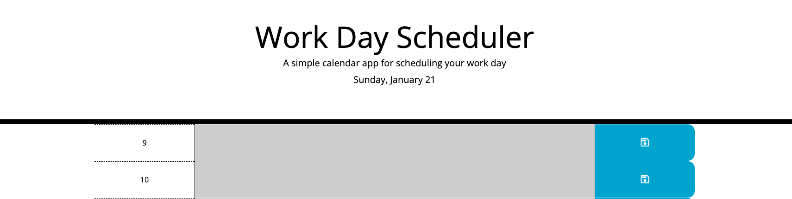

# daily-planner

## Description

The landing page for Horiseon, a fictional company that helps optimise SEO (an educated guess from the project brief!). This project was refactoring an existing codebase to introduce accessibility techniques such as semantic tags (as opposed to an entire page made up of divs) and alternative (alt) text. Additionally, the CSS stylesheet was analysed and reorganised for clarity and ease of use for future developers.

I haven't refactored code before, so it was great to approach a project in this way and identify what can be changed and improved upon, something I can imagine is a regular occurence in codebases with thousands of lines of code. It was a great project to put into practice what we have learned so far, I really enjoyed it.

## Installation

No installation necessary. Please visit https://alex-quayle.github.io/daily-planner/ to view the webpage. Below is a screenshot of the deployed page:

## Credits

The HTML and CSS (except for minor adjustments) for this project was provided by edX. In addition to the following links, the class sessions held by the edX front-end bootcamp team have been invaluable for this challenge, especially in my understanding of JQuery and event delegation.

> Mozilla Developers Network (2023, November 29). Using data attributes. https://developer.mozilla.org/en-US/docs/Learn/HTML/Howto/Use_data_attributes. 

> W3Schools (n.d.). HTML <textarea> tag. https://www.w3schools.com/tags/tag_textarea.asp.

> W3Schools (n.d.). jQuery Event Methods. https://www.w3schools.com/jquery/jquery_events.asp.

> W3Schools (n.d.). jQuery ready() Method. https://www.w3schools.com/jquery/event_ready.asp.